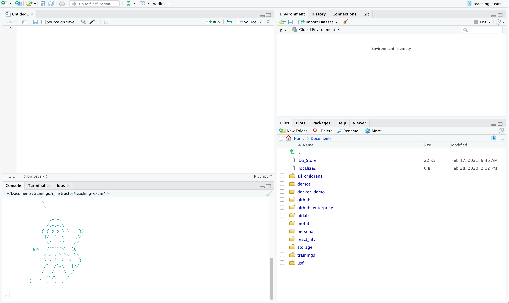
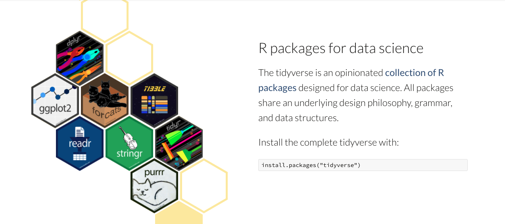
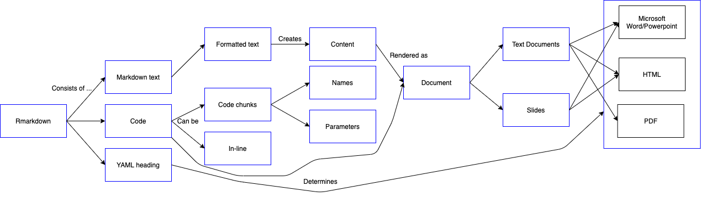
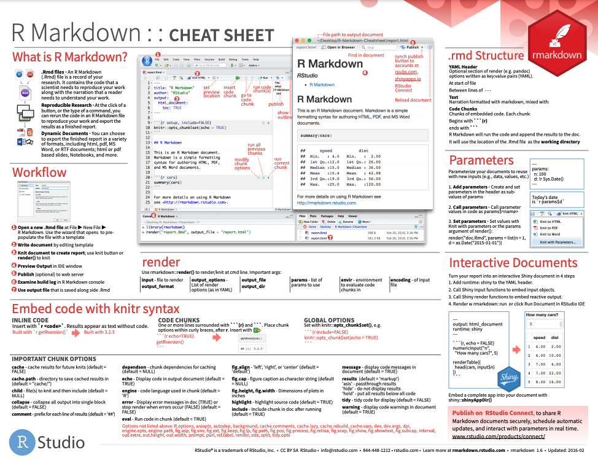

```{r setup, include=FALSE}
options(htmltools.dir.version = FALSE)
knitr::opts_chunk$set(
  fig.width=9, fig.height=3.5, fig.retina=3,
  out.width = "100%",
  cache = FALSE,
  echo = TRUE,
  message = FALSE, 
  warning = FALSE, 
  hiline = TRUE
)
options(width = 70)
```

name: title
class: left bottom hide-count

<!-- Slide Extras -->

```{r xaringan-extras, echo=FALSE, results="asis"}
# remotes::install_github("gadenbuie/xaringanExtra")
xaringanExtra::use_xaringan_extra(c(
  "tile_view"
  # "editable",
  # "animate",
  # "panelset"
))
```

<!-- Title Slide -->
<!-- <div class="talk-logo"></div> -->

.talk-meta[
.talk-title[
# `r rmarkdown::metadata$title`

`r rmarkdown::metadata$subtitle`
]

.talk-author[
`r paste(rmarkdown::metadata$author, collapse = " &middot; ")`<br>
.moffitt-gray[`r paste(rmarkdown::metadata$institute, collapse = ", ")`]
]

.talk-date.moffitt-gray[
`r knitr::knit(text = rmarkdown::metadata$date)`
]
]


```{css echo=FALSE}
/* Define title slide image or logo here */
.talk-logo {
  width: 400px;
  height: 750px;
  position: absolute;
  top: 6%;
  right: 7%;
  /* background-image: url('img/r4ds-cover.png'); */
  background-size: contain;
  background-repeat: no-repeat;
  background-position: contain;
}
```

<!-- Moffitt Logo and Slide Border ----

All slides except "title" and "inverse" slides
have the Moffitt Color Bar and logo.

Additional classes are provided to disable both:

- `class: no-logo` hides the logo
- `class: no-border` hides the border

or to force either to be shown

- `class: moffitt-slide-logo` shows the logo
- `class: moffitt-slide-border` shows the border
-->

---
class: inverse center middle

# R & RStudio

---

### RStudio 



???

RStudio a GUI for the R language. 

---
### Packges

A `package` is a collection of functions, data, and documentation that extend
the functionality of R.

`install.packages("foo")`

vs

`library("foo")`

---
### The tidyverse


---
## Data types and structures

Data types: 

*   logical - `TRUE` or `FALSE`
*   numeric or integer - `22.2`
*   character - `"character example"`
    
Data structures: 
    
*   vector - `c(1:4, 5, 6)`
*   list - `list(c(1:4), 12, "banana")`
*   matrix 
*   dataframe/tibble
    
`tibble` and `dataframe` - look and perform virtually the same with the biggest difference 
being that `dataframes` have rows and `tibbles` do not 

---


[r cheatsheets](https://www.rstudio.com/resources/cheatsheets/)

---
## R Projects & `here()`

Working directory = where R looks for your files 

Setting absolute paths can be problematic - especially if you are working on a
project that uses Windows/Mac/Linux

R Projects provide a structure for storing all files, data, scripts and output for 
a project

To create a new Project: `File` > `New Directory` > `New Project`
and fill out the information  

`r emo::ji("cloud")` In RStudio Cloud we will be working inside a project 
so you will not have the option to create projects and switch between them.


---
class: inverse center middle

# Rmarkdown

---
## Rmarkdown


Allows you to share code, comments and outputs easily 

`r emo::ji("star")` REPRODUCIBLE! `r emo::ji("star")`

3 elements: YAML header, formatted text, code 

---
## Rmarkdown



---
## YAML

Located at the top of your file and enclosed by `---`

Controls "whole document" parameters and settings 

```
---
title: "My super cool document"
author: 
  - Jordan Creed
output: html_document
---
```

---
## Formatted Text 

Rmarkdown uses regular markdown rules/syntax.

When you `knit` your document the final output will display according 
to the formatting rules on your `.Rmd`

---
## Code

Code can be written as either code chunks or inline code

Output can be modified by chunk options placed inside `{}`

  * `eval = FALSE` keeps code from being evaluated 
  * `echo = FALSE` keeps code from being displayed 
  * `message = FALSE` and `warning = FALSE` keeps messages/warnings from being displayed
  
---
## 



---

## GitHub

.pull-left[
* GitHub is a code hosting platform used for collaborating and code sharing
* Materials and information for the course can be found on the class GitHub page
* Class GitHub: [https://github.com/FridleyLab/Introduction-to-R](https://github.com/FridleyLab/Introduction-to-R)
]

.pull-right[]

---

## RStudio Cloud

To get started:

* Create an account with [RStudio Cloud](https://login.rstudio.cloud/register)
* Log in
* To your right you should see "Introduction To R Programming Class (2021)" -
click on it 
* Under "Projects" press "Start" beside "Lab One"