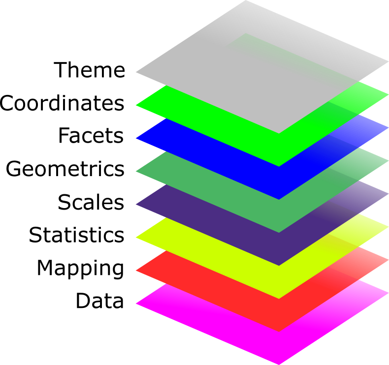

```{r setup, include=FALSE}
options(htmltools.dir.version = FALSE)
knitr::opts_chunk$set(
  fig.width=9, fig.height=3.5, fig.retina=3,
  out.width = "100%",
  cache = FALSE,
  echo = TRUE,
  message = FALSE, 
  warning = FALSE, 
  hiline = TRUE
)
options(width = 70)
```

name: title
class: left center hide-count

<!-- Slide Extras -->

```{r xaringan-extras, echo=FALSE, results="asis"}
# remotes::install_github("gadenbuie/xaringanExtra")
xaringanExtra::use_xaringan_extra(c(
  "tile_view"
  # "editable",
  # "animate",
  # "panelset"
))
```

<!-- Title Slide -->
<!-- <div class="talk-logo"></div> -->

.talk-meta[
.talk-title[
# `r rmarkdown::metadata$title`

`r rmarkdown::metadata$subtitle`
]

.talk-author[
`r paste(rmarkdown::metadata$author, collapse = " &middot; ")`<br>
.moffitt-gray[`r paste(rmarkdown::metadata$institute, collapse = ", ")`]
]

.talk-date.moffitt-gray[
`r knitr::knit(text = rmarkdown::metadata$date)`
]
]


```{css echo=FALSE}
/* Define title slide image or logo here */
.talk-logo {
  width: 400px;
  height: 750px;
  position: absolute;
  top: 6%;
  right: 7%;
  /* background-image: url('img/r4ds-cover.png'); */
  background-size: contain;
  background-repeat: no-repeat;
  background-position: contain;
}
```

<!-- Moffitt Logo and Slide Border ----

All slides except "title" and "inverse" slides
have the Moffitt Color Bar and logo.

Additional classes are provided to disable both:

- `class: no-logo` hides the logo
- `class: no-border` hides the border

or to force either to be shown

- `class: moffitt-slide-logo` shows the logo
- `class: moffitt-slide-border` shows the border
-->

---
class: middle

- Data visualization is important in most phases of data analysis workflow i.e. from exploratory data analysis to effectively communicating our results

- {`ggplot2`} is one of the most popular R packages for data visualization. It is a part of {`tidyverse`} R meta-package

- {`ggplot2`} is based on a set of principles "Grammar of graphic" 

- Statistical graphic is a mapping from data to aesthetics (such as color, shape and size) represented by geometrics (such as points, lines etc.)

- The basic idea is that a statistical graphic can be created in a layered fashion, starting with a layer showing the data then adding layers of graphical objects, annotations and statistical summaries

---
## Grammar of graphics

.w-50.center[

]

---
### Data layer

Data to be plotted

{`ggplot2`} prefers data to be in *tidy* format 

Key features of tidy data:
- Each column is a variable
- Each row is an observation
- Each value must have its own cell


> *Most of plotting problems in ggplot2 boil down to data wrangling problems*

---

