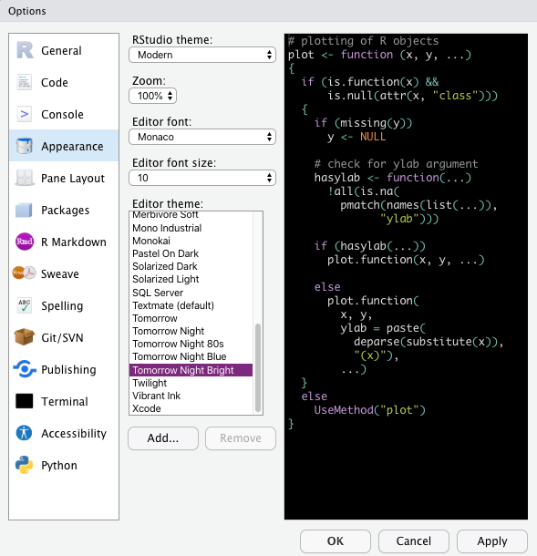
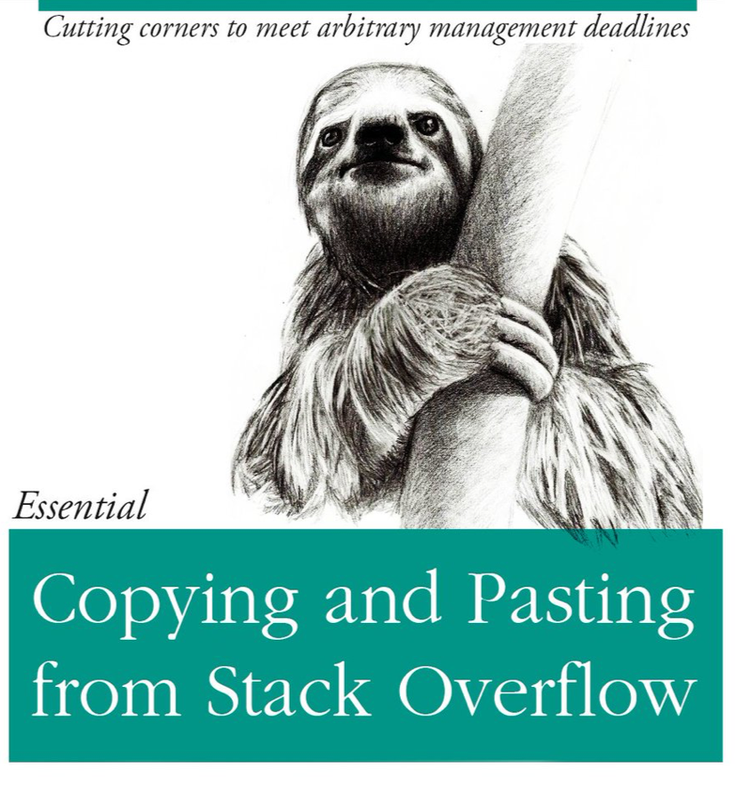

```{r setup, include=FALSE}
options(htmltools.dir.version = FALSE)
knitr::opts_chunk$set(
  fig.width=9, fig.height=3.5, fig.retina=3,
  out.width = "100%",
  cache = FALSE,
  echo = TRUE,
  message = FALSE, 
  warning = FALSE, 
  hiline = TRUE
)
options(width = 70)
```

name: title
class: left bottom hide-count

<!-- Slide Extras -->

```{r xaringan-extras, echo=FALSE, results="asis"}
# remotes::install_github("gadenbuie/xaringanExtra")
xaringanExtra::use_xaringan_extra(c(
  "tile_view"
  # "editable",
  # "animate",
  # "panelset"
))
```

<!-- Title Slide -->
<!-- <div class="talk-logo"></div> -->

.talk-meta[
.talk-title[
# `r rmarkdown::metadata$title`

`r rmarkdown::metadata$subtitle`
]

.talk-author[
`r paste(rmarkdown::metadata$author, collapse = " &middot; ")`<br>
.moffitt-gray[`r paste(rmarkdown::metadata$institute, collapse = ", ")`]
]

.talk-date.moffitt-gray[
`r knitr::knit(text = rmarkdown::metadata$date)`
]
]


```{css echo=FALSE}
/* Define title slide image or logo here */
.talk-logo {
  width: 400px;
  height: 750px;
  position: absolute;
  top: 6%;
  right: 7%;
  /* background-image: url('img/r4ds-cover.png'); */
  background-size: contain;
  background-repeat: no-repeat;
  background-position: contain;
}

.h-10 { height: 10%; }
```

<!-- Moffitt Logo and Slide Border ----

All slides except "title" and "inverse" slides
have the Moffitt Color Bar and logo.

Additional classes are provided to disable both:

- `class: no-logo` hides the logo
- `class: no-border` hides the border

or to force either to be shown

- `class: moffitt-slide-logo` shows the logo
- `class: moffitt-slide-border` shows the border
-->

---
class: inverse center middle

# Setting up Your R

---

## Installing R & RStudio

Need to install each version of R 

  - [https://mirrors.nics.utk.edu/cran/](https://mirrors.nics.utk.edu/cran/)
  
Then install RStudio independently 

  - [https://www.rstudio.com/products/rstudio/download/](https://www.rstudio.com/products/rstudio/download/)

You need to have R installed BEFORE you can install RStudio. You also need
to update them independently. 

---

## Local RStudio installation vs RStudio Cloud

.pull-left[
#### Local

*  Free
*  May be restricted by IT
*  Versioning dependent on user
]

.pull-right[

#### Cloud

*  Paid
*  Access via web browser
*  Standardized version/packages
]

---

## R appearence 

.pull-left[
Tools > Global Options 

- edit font, text size and color scheme 

Code > Rainbow Parentheses 
]

.pull-right[

{width="50"}

]

---

## `.Renviron` and `.Rprofile`

`.Renviron` contains sensitive information or R environmental variables 

  - store API/GitHub keys 
  - specify RAM 
  - NOT R CODE - same code as used in the command line 
  - `usethis::edit_r_environ()`
  
`.Rprofile` is R code run every time R starts up

  - Create welcome messages 
  - Load frequently used packages 
  - `usethis::edit_r_profile()`
  
---

## R Community

.pull-left[

  - [Stack Overflow](https://stackoverflow.com/questions/tagged/r)
  - [R Community](https://community.rstudio.com/)
  - [R for Data Science](https://r4ds.had.co.nz/)
      - Anything written by Hadley Wickham, Garret Grolemund, 
      Yihui Xie, Jenny Bryan 
  - [#rstats](https://twitter.com/hashtag/rstats?lang=en)


]

.h-10.pull-right[



]

---
class: inverse center middle

# Best Coding Practices

---

## Have you tried turning it off and then on again?

-   Start with a new, clean session
-   Re-start often

---

## Naming things 

.pull-left[

Good names should be:

-   machine readable 
    - no spaces, strange punctuation, or odd cases
-   human readable 
    - name contains details on content
-   works with default ordering
    - numbers first 
    - standard dates (YYYY-MM-DD)
    - left pad numbers 
]

.pull-right[


]

---

## Code Style 

  - Line length around 80 characters
  - Object and data names should be informative
  - Consistency is key - names, indents, spacing
  - [https://style.tidyverse.org/](https://style.tidyverse.org/)

---

## Comments


---
class: inverse center middle

# GitHub

---

## GitHub basics

**What is GitHub?**

  - Code hosting platform
  - Used for version control
  - GitHub, GitHub Enterprise, GitLab (`r emo::ji("meh")`)

**Why do we care?**

  - Distribute R packages
  - Collaborate on code
  - Explore other projects 
  - Project manager
  - Repos are **CITABLE**
  
`r emo::ji("coder")` Paul Stewart of the Moffitt BioData Club does a Git
training about once a year which I highly recommend if you are interested in
learning more about Git [https://github.com/pstew/biodataclub/tree/master/meetings/2018-10_git](https://github.com/pstew/biodataclub/tree/master/meetings/2018-10_git)
---

